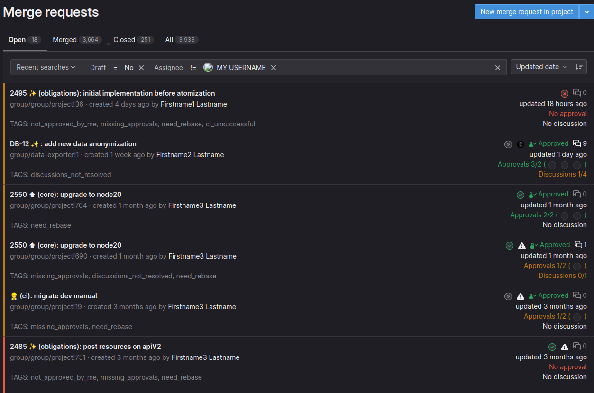

# Git buster
Add informations on the gitlab MR list

### My list

### List of others

## Badges
| Badge   	| Color   	                                                         | Description                   	|
|---------	|--------------------------------------------------------------------|-------------------------------	|
| ACTIONS 	|  `#ec5941` | You have something to do      	|
| WAIT    	|  `#c17d10` | Others have something to do   	|
| DONE    	|  `#2da160` | Congratulation, you can merge 	|

## Tags
#### The MR is mine (in order)
| Tag                      	 | Badge   	 |
|----------------------------|-----------|
| DISCUSSIONS_NOT_RESOLVED 	 | ACTIONS 	 |
| CI_UNSUCCESSFUL          	 | ACTIONS 	 |
| NEED_REBASE              	 | ACTIONS 	 |
| MISSING_APPROVALS        	 | WAIT    	 |
#### The MR not is mine (in order)
| Tag                      	 | Badge   	 |
|----------------------------|-----------|
| CI_UNSUCCESSFUL          	 | WAIT    	 |
| DISCUSSIONS_NOT_RESOLVED 	 | WAIT    	 |
| NOT_APPROVED_BY_ME       	 | ACTIONS 	 |
| MISSING_APPROVALS        	 | WAIT    	 |
| NEED_REBASE              	 | WAIT    	 |

## Synthetic Overview Page
A new sidebar button "Git Buster" is injected into the GitLab sidebar (super-sidebar or legacy) whenever you browse a URL that starts with your configured `baseUrl` and the extension is enabled.

Clicking the button toggles a synthetic overview page that replaces the main content area and shows:
- A table of the currently listed merge requests
- Calculated tags and their badges
- A consolidated badge per MR
- Persistent local filters: "Hide draft MRs", "Only hotfix MRs", and Author scope (All / Mine / Others)
- Ephemeral author filter (autocomplete): ad-hoc text/datalist filter by username or full name; disabled when persistent Author scope is set to Mine; not stored across reloads.
- Per-MR magnifying glass button: if the MR title contains a JIRA-like ticket (e.g. ABC-123), clicking adds it to the title filter without duplication; disabled if no ticket pattern is found.

Hotfix definition (overview page filter):
- Targets `main` or `master` branch OR
- Title contains the ambulance emoji 🚑

The overview header shows both total and currently displayed hotfix counts (Hotfixes: displayed/total). Hover the "Only hotfix MRs" checkbox to read the tooltip summarizing the definition.

Click the button again to return to the normal GitLab view.

Edge cases & notes:
- The button reappears automatically after GitLab SPA navigations if it's removed.
- Draft MRs and old MRs are filtered out according to your settings (`skipDrafts`, `ignoreAfterMonth`).
- The page is purely client-side; no additional permissions were added beyond existing API calls.
- Hotfix filter persists between page loads using `localStorage`.
- Author filter persists between page loads. "Mine" / "Others" are disabled if no `username` is configured.

Configuration reminders (via the popup/options):
- `enable`: master switch
- `baseUrl`: your GitLab base (e.g. https://gitlab.example.com)
- `username`: used to decide which MRs are yours
- `skipDrafts`, `ignoreAfterMonth`, `requiredApprovals`, `facultativeApprovers`
